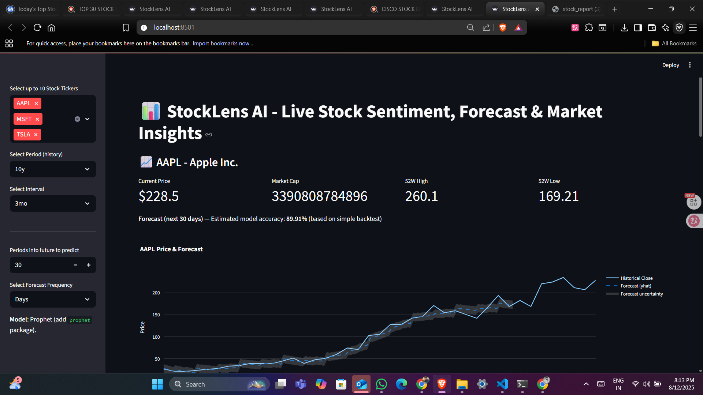

# StockLensAi

  <!-- Replace with your image path -->

StockLensAi is a project that provides a curated list of top international stocks, helping users get quick insights into key global market players. This repository contains data and tools related to analyzing and visualizing international stock information.

## Features

- List of top 100 international stocks with ticker symbols  
- Supports multiple global markets and sectors  
- Ready for integration with AI or data analysis tools  
- Simple and easy-to-understand structure for further development  

## Getting Started

### Prerequisites

- Python 3.x installed on your system

### Installation & Setup

Run the following commands in your terminal to clone the repo, create and activate a virtual environment, and install dependencies:

```bash
# Clone the repository
git clone https://github.com/Manishkumarsingh41/StockLensAi.git
cd StockLensAi

# Create a virtual environment named 'venv'
python -m venv venv

# Activate the virtual environment
# Windows (Command Prompt)
venv\Scripts\activate

# Windows (PowerShell)
# .\venv\Scripts\Activate.ps1

# macOS/Linux
# source venv/bin/activate

# Install dependencies from requirements.txt
pip install -r requirements.txt
