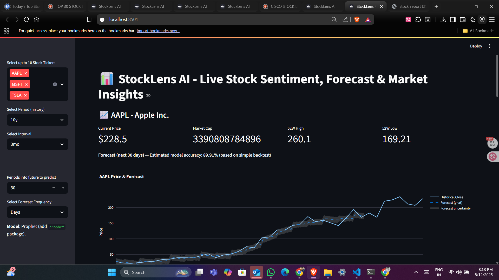

# 📊 StockLensAI — AI-Powered Stock Analysis & Forecasting

## 🚀 Production-Ready AI System

StockLensAI is an AI-powered stock analysis platform that provides insights into top international stocks using **sentiment analysis and time-series forecasting**.

---

## 🌐 Overview

StockLensAI enables users to:

- Explore top international stocks across global markets  
- Analyze financial news sentiment using NLP models  
- Forecast future stock prices using time-series models  
- Evaluate prediction accuracy with performance metrics  

---

## 🎯 Problem Statement

Stock market analysis is complex because:

- Data is scattered across multiple sources  
- News sentiment impacts stock prices but is hard to quantify  
- Forecasting future trends requires statistical modeling  

StockLensAI solves this using **data analysis + NLP + time-series forecasting**.

---

## 🧩 System Architecture

Stock Data  
→ News Data Collection  
→ Sentiment Analysis (FinBERT)  
→ Time Series Forecasting (Prophet)  
→ Performance Evaluation (MAPE)  
→ Insights & Visualization  

---

## ⚙️ Tech Stack

**Backend / Core:**
- Python  
- Pandas, NumPy  

**Machine Learning:**
- FinBERT (Sentiment Analysis)  
- Facebook Prophet (Time Series Forecasting)  

**Visualization:**
- Matplotlib / Data Visualization Tools  

---

## 🔥 Key Features

- Top 100 international stocks dataset  
- Sentiment analysis using FinBERT  
- Stock price forecasting using Prophet  
- Forecast accuracy evaluation (MAPE)  
- Ready for integration with AI pipelines  
- Clean and extensible project structure  

---

## 📸 Demo



---

## 📁 Project Structure

```text
StockLensAI/
├── data/
├── notebooks/
├── models/
├── scripts/
├── images/
│   └── stocklensai_screenshot.png
├── requirements.txt
└── README.md
```
##🛠️ Setup

## Clone repository:
```text
git clone https://github.com/Manishkumarsingh41/StockLensAi.git
cd StockLensAi
```

## Create virtual environment:
```text
python -m venv venv
venv\Scripts\activate        # Windows
# source venv/bin/activate   # macOS/Linux
```
## Install dependencies:
```text
pip install -r requirements.txt
```
## ⚡ Reliability

StockLensAI ensures reliable outputs through:

- Structured data processing pipeline  
- Pretrained NLP model for sentiment analysis  
- Robust forecasting using Prophet  
- Performance evaluation using MAPE  

---

## 🏆 Why This Project Stands Out

This is not just a dataset project.

It is an AI system combining:

- Natural Language Processing (FinBERT)  
- Time-series forecasting (Prophet)  
- Data analysis and visualization  

Demonstrates real-world financial AI applications.

---

## 🚀 Future Improvements

Planned enhancements include:

- Real-time stock data integration  
- Interactive dashboard (Streamlit / React)  
- Advanced portfolio analytics  
- Deployment as a web application  

---

## 📫 Connect

- GitHub: https://github.com/Manishkumarsingh41  
- LinkedIn: https://www.linkedin.com/in/manish-kumar-singh-5a8162214/  
- Portfolio: https://manishkumarsingh41.github.io/myportfolio/
